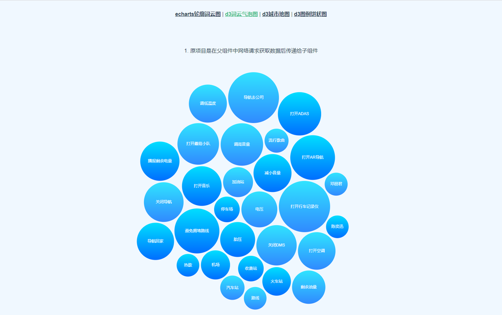
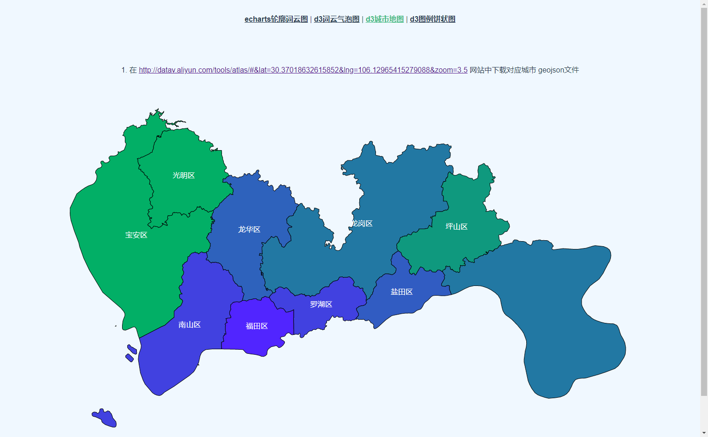
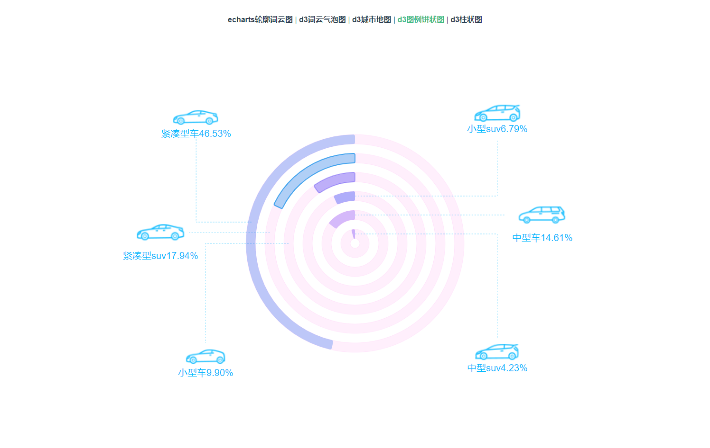
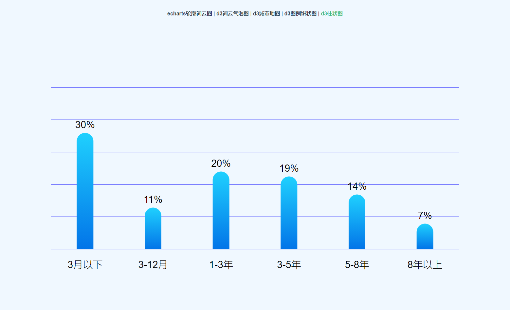

# vuechartsmap

## VUE + Echarts + D3 绘制图表

## Project setup
```
npm install
```

### Compiles and hot-reloads for development
```
npm run serve
```

### Compiles and minifies for production
```
npm run build
```

### Lints and fixes files
```
npm run lint
```

版本对应: 

"d3": "^6.5.0"
"echarts": "^5.0.1"
"echarts-wordcloud": "^2.0.0"
"vue": "^2.6.11"

主要内容 D3 绘制 图表

### 项目中图表列举

#### 1. Echarts 词云图


#### 2. D3 气泡图


#### 3. 城市地图
svg / geojson 下载地址: http://datav.aliyun.com/tools/atlas


#### 4. 图例饼状图


#### 5. 圆柱状图



